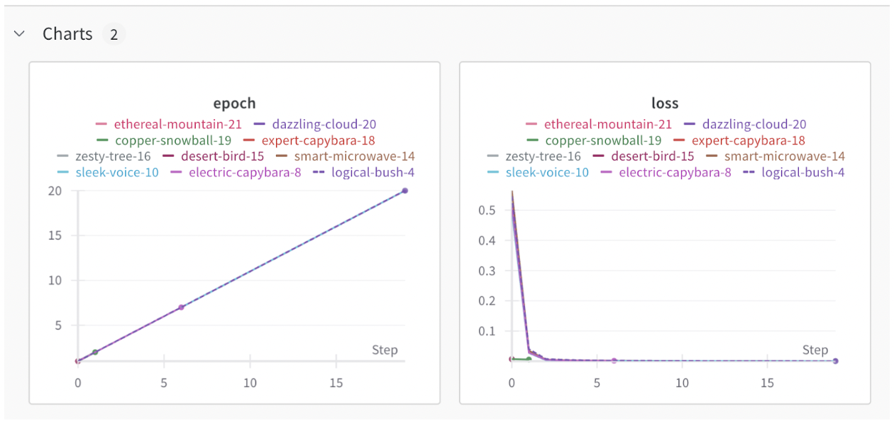
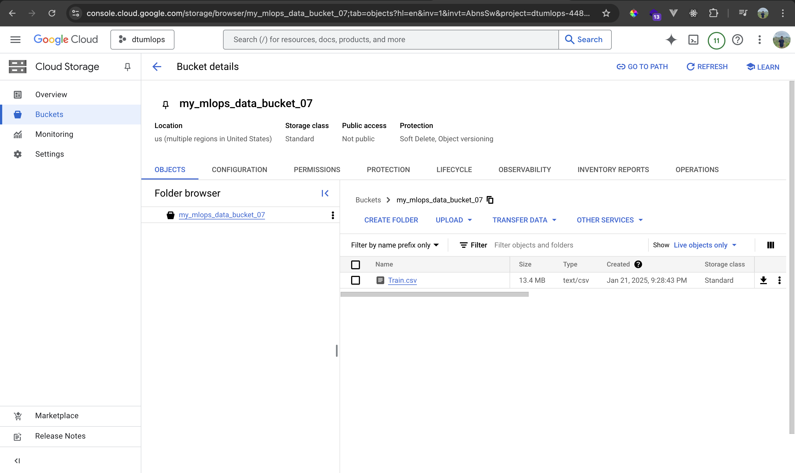
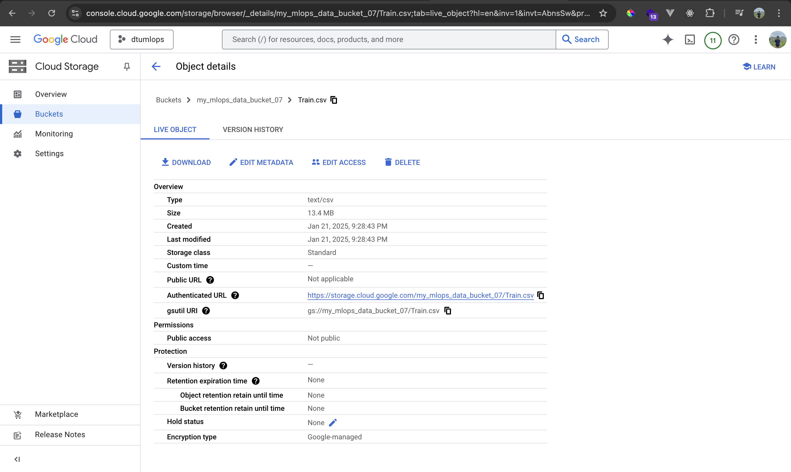
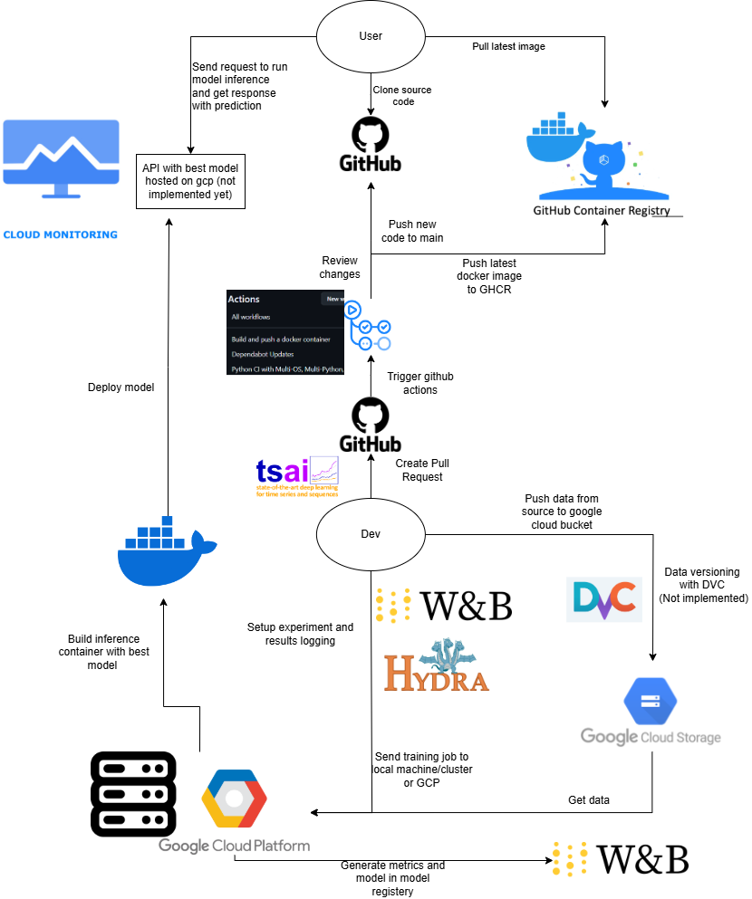

# Exam template for 02476 Machine Learning Operations

This is the report template for the exam. Please only remove the text formatted as with three dashes in front and behind
like:

```--- question 1 fill here ---```

Where you instead should add your answers. Any other changes may have unwanted consequences when your report is
auto-generated at the end of the course. For questions where you are asked to include images, start by adding the image
to the `figures` subfolder (please only use `.png`, `.jpg` or `.jpeg`) and then add the following code in your answer:

```markdown

```

In addition to this markdown file, we also provide the `report.py` script that provides two utility functions:

Running:

```bash
python report.py html
```

Will generate a `.html` page of your report. After the deadline for answering this template, we will auto-scrape
everything in this `reports` folder and then use this utility to generate a `.html` page that will be your serve
as your final hand-in.

Running

```bash
python report.py check
```

Will check your answers in this template against the constraints listed for each question e.g. is your answer too
short, too long, or have you included an image when asked. For both functions to work you mustn't rename anything.
The script has two dependencies that can be installed with

```bash
pip install typer markdown
```

## Overall project checklist

The checklist is *exhaustive* which means that it includes everything that you could do on the project included in the
curriculum in this course. Therefore, we do not expect at all that you have checked all boxes at the end of the project.
The parenthesis at the end indicates what module the bullet point is related to. Please be honest in your answers, we
will check the repositories and the code to verify your answers.

### Week 1

* [x] Create a git repository (M5)
* [x] Make sure that all team members have write access to the GitHub repository (M5)
* [x] Create a dedicated environment for you project to keep track of your packages (M2)
* [x] Create the initial file structure using cookiecutter with an appropriate template (M6)
* [x] Fill out the `data.py` file such that it downloads whatever data you need and preprocesses it (if necessary) (M6)
* [x] Add a model to `model.py` and a training procedure to `train.py` and get that running (M6)
* [x] Remember to fill out the `requirements.txt` and `requirements_dev.txt` file with whatever dependencies that you
    are using (M2+M6)
    (Karol)
* [x] Remember to comply with good coding practices (`pep8`) while doing the project (M7)  (Kazi)
* [x] Do a bit of code typing and remember to document essential parts of your code (M7)
* [ ] Setup version control for your data or part of your data (M8)
* [x] Add command line interfaces and project commands to your code where it makes sense (M9)
* [x] Construct one or multiple docker files for your code (M10)
* [x] Build the docker files locally and make sure they work as intended (M10) 
* [x] Write one or multiple configurations files for your experiments (M11) 
* [x] Used Hydra to load the configurations and manage your hyperparameters (M11)
* [ ] X Use profiling to optimize your code (M12)  
* [x] Use logging to log important events in your code (M14) 
* [x] Use Weights & Biases to log training progress and other important metrics/artifacts in your code (M14)
* [x] Consider running a hyperparameter optimization sweep (M14)
* [ ] Use PyTorch-lightning (if applicable) to reduce the amount of boilerplate in your code (M15)

### Week 2

* [x] Write unit tests related to the data part of your code (M16) 
* [x] Write unit tests related to model construction and or model training (M16)
* [x] Calculate the code coverage (M16) 
* [ ] 
* [x] Get some continuous integration running on the GitHub repository (M17) 
* [x] Add caching and multi-os/python/pytorch testing to your continuous integration (M17)
* [x] Add a linting step to your continuous integration (M17) 
* [x] Add pre-commit hooks to your version control setup (M18)
* [ ] Add a continues workflow that triggers when data changes (M19) 
* [ ] 
* [x] Add a continues workflow that triggers when changes to the model registry is made (M19) 
* [ ] 
* [x] Create a data storage in GCP Bucket for your data and link this with your data version control setup (M21)
* [x] Create a trigger workflow for automatically building your docker images (M21) 
* [x] Get your model training in GCP using either the Engine or Vertex AI (M21)
* [x] Create a FastAPI application that can do inference using your model (M22)
* [ ] Deploy your model in GCP using either Functions or Run as the backend (M23) (3.Kazi )
* [x] Write API tests for your application and setup continues integration for these (M24)
* [x] Load test your application (M24)
* [ ] Create a more specialized ML-deployment API using either ONNX or BentoML, or both (M25) (5.Samyak )
* [x] Create a frontend for your API (M26)

### Week 3

* [ ] Check how robust your model is towards data drifting (M27) 
* [ ] Deploy to the cloud a drift detection API (M27) 
* [ ] Instrument your API with a couple of system metrics (M28) 
* [ ] Setup cloud monitoring of your instrumented application (M28) 
* [ ] Create one or more alert systems in GCP to alert you if your app is not behaving correctly (M28) 
* [ ] If applicable, optimize the performance of your data loading using distributed data loading (M29) 
* [ ] If applicable, optimize the performance of your training pipeline by using distributed training (M30) 
* [ ] Play around with quantization, compilation and pruning for you trained models to increase inference speed (M31) 

### Extra

* [ ] Write some documentation for your application (M32)
* [ ] Publish the documentation to GitHub Pages (M32)
* [x] Revisit your initial project description. Did the project turn out as you wanted?
* [x] Create an architectural diagram over your MLOps pipeline
* [x] Make sure all group members have an understanding about all parts of the project
* [x] Uploaded all your code to GitHub

## Group information

### Question 1
> **Enter the group number you signed up on <learn.inside.dtu.dk>**
>
> Answer:

Group 7


### Question 2
> **Enter the study number for each member in the group**
>
> Example:
>
> *sXXXXXX, sXXXXXX, sXXXXXX*
>
> Answer:

s204145, s232883, s232924, s230208


### Question 3
> **A requirement to the project is that you include a third-party package not covered in the course. What framework**
> **did you choose to work with and did it help you complete the project?**
>
> Recommended answer length: 100-200 words.
>
> Example:
> *We used the third-party framework ... in our project. We used functionality ... and functionality ... from the*
> *package to do ... and ... in our project*.
>
> Answer:

We used the third-party framework tsai (https://timeseriesai.github.io/tsai/) to work with time series data. This framework provided pre-implemented models like LSTM, allowing us to experiment quickly with different time series architectures without building models from scratch. Its streamlined API significantly accelerated our workflow and made trying various approaches efficient. Additionally, we used the Black code formatter to maintain code consistency and readability. While the course used Ruff, we preferred Black for its simplicity and widespread adoption. Together, these tools enhanced the project by simplifying model experimentation and ensuring well-formatted, maintainable code throughout development. We also used methods built-in sklearn to perform data preprocessing.

## Coding environment

> In the following section we are interested in learning more about you local development environment. This includes
> how you managed dependencies, the structure of your code and how you managed code quality.

### Question 4

> **Explain how you managed dependencies in your project? Explain the process a new team member would have to go**
> **through to get an exact copy of your environment.**
>
> Recommended answer length: 100-200 words
>
> Example:
> *We used ... for managing our dependencies. The list of dependencies was auto-generated using ... . To get a*
> *complete copy of our development environment, one would have to run the following commands*
>
> Answer:

We used requirements.txt file for managing our dependencies. The list of dependencies was inistally auto-generated using pipreqs. Then if somebody used library not included in requirements he should add it there in pull request. To get a complete copy of our development environment, one would have to run the following commands. 
1. Copy repository
2. Create virtual env using preferred tool eg conda: conda create --name my_environment python=3.11
3. install requirements using: pip3 install -r requirements_dev.txt

   As an alternative - one can run scripts using docker that is automatically build when there is push to main branch. To do it - person should follow instructions on README.md.
   Current setup allows either build docker image locally or pull it from github docker registery. 

--- question 4 fill here ---

### Question 5

> **We expect that you initialized your project using the cookiecutter template. Explain the overall structure of your**
> **code. What did you fill out? Did you deviate from the template in some way?**
>
> Recommended answer length: 100-200 words
>
> Example:
> *From the cookiecutter template we have filled out the ... , ... and ... folder. We have removed the ... folder*
> *because we did not use any ... in our project. We have added an ... folder that contains ... for running our*
> *experiments.*
>
> Answer:

From the cookiecutter template, we have filled out the src, configs, data, tests, reports and workflows folders. The src folder contains the main codebase for our project, including modules for data processing, model definition, and training procedures. The tests folder includes unit tests for validating our code’s correctness and ensuring robustness. The reports folder is used for documenting our progress and providing visualizations of our results.

We did not remove any default folders from the template but made modifications to suit our project needs. For instance, we added submodules within the src folder, such as mlops_2025_floods_prediction, to organize our project’s logic better. Additionally, we included a configs folder in the root directory for managing experiment configurations using Hydra.

These changes allowed us to maintain a clean and modular structure, making the project easy to navigate and extend.

### Question 6

> **Did you implement any rules for code quality and format? What about typing and documentation? Additionally,**
> **explain with your own words why these concepts matters in larger projects.**
>
> Recommended answer length: 100-200 words.
>
> Example:
> *We used ... for linting and ... for formatting. We also used ... for typing and ... for documentation. These*
> *concepts are important in larger projects because ... . For example, typing ...*
>
> Answer:

We used flake8 for linting to ensure adherence to Python's best practices and to catch common errors, such as unused imports or undefined variables. For code formatting, we followed PEP8 standards and utilized Black as a pre-commit hook to enforce consistent formatting across the project automatically. This ensures that all code remains clean, readable, and standardized.

These ideas guarantee maintainability, scalability, and seamless cooperation, which makes them essential for larger projects. Linting, for example, avoids logical and stylistic mistakes, and uniform formatting speeds up code reviews and gets rid of style arguments.


--- question 6 fill here ---

## Version control

> In the following section we are interested in how version control was used in your project during development to
> corporate and increase the quality of your code.

### Question 7

> **How many tests did you implement and what are they testing in your code?**
>
> Recommended answer length: 50-100 words.
>
> Example:
> *In total we have implemented X tests. Primarily we are testing ... and ... as these the most critical parts of our*
> *application but also ... .*
>
> Answer:

In total, we have implemented 4 tests. Primarily we are testing data and model scripts as they are currently the most critical parts of our project. This includes checking if the dataset is correctly initialized, preprocessed, and saved in the correct folder. Additionally, we check if the model architecture is correct and model output has the correct shape and value ranges. 

--- question 7 fill here ---

### Question 8

> **What is the total code coverage (in percentage) of your code? If your code had a code coverage of 100% (or close**
> **to), would you still trust it to be error free? Explain you reasoning.**
>
> Recommended answer length: 100-200 words.
>
> Example:
> *The total code coverage of code is X%, which includes all our source code. We are far from 100% coverage of our **
> *code and even if we were then...*
>
> Answer:

The total code coverage of our code is 57%, mainly covering parts related to data processing and training. While higher coverage is good, even 100% coverage doesn’t mean the code is free of errors. Code coverage only shows that every line of code has been run during testing, but it doesn’t catch all possible issues.
For example, tests might miss problems like unexpected inputs, edge cases, or how different parts of the system work together. Tests can also fail to check if the results are correct, giving a false sense of security.
To make sure the code is reliable, it’s not enough to just have high coverage. The quality of the tests matters more. Good tests check for edge cases, confirm the logic is correct, and ensure the system behaves well in all situations

--- question 8 fill here ---

### Question 9

> **Did you workflow include using branches and pull requests? If yes, explain how. If not, explain how branches and**
> **pull request can help improve version control.**
>
> Recommended answer length: 100-200 words.
>
> Example:
> *We made use of both branches and PRs in our project. In our group, each member had an branch that they worked on in*
> *addition to the main branch. To merge code we ...*
>
> Answer:

We used branches and pull requests (PRs) to manage our workflow. Each team member worked on their own feature branch to keep changes separate from the main branch. This allowed us to develop and test without disrupting the stable codebase. When a feature was ready, we opened a PR to merge it into the main branch.
PRs acted as checkpoints for code review, feedback, and ensuring adherence to project standards. Our CI/CD pipeline ran tests and linting checks on every PR and push, helping us catch issues early and maintain code quality.
This workflow enabled parallel development, reduced conflicts, ensured through code reviews, and kept the main branch stable, enhancing collaboration and reliability.


--- question 9 fill here ---

### Question 10 (Samyak)

> **Did you use DVC for managing data in your project? If yes, then how did it improve your project to have version**
> **control of your data. If no, explain a case where it would be beneficial to have version control of your data.**
>
> Recommended answer length: 100-200 words.
>
> Example:
> *We did make use of DVC in the following way: ... . In the end it helped us in ... for controlling ... part of our*
> *pipeline*
>
> Answer:

We did not use DVC in this project, though it would be of great use. DVC allows for the versioning of datasets, facilitating reproducibility by pinning specific versions of data to experiments. This makes tracking and debugging much easier if something in the data or one of the preprocessing steps changes.

Moreover, DVC promotes collaboration in that teams can share and synchronize datasets with remote storage; hence no manual handling of the data is required. Compatibility with Git would also have optimized our workflow in ensuring that data and code versions were unified—hence improving the consistency and traceability of the experiments.

This would allow for a much more structured and scalable way of handling datasets, especially as projects get too complicated or need frequent changes in data or preprocessing pipelines.


--- question 10 fill here ---

### Question 11

> **Discuss you continuous integration setup. What kind of continuous integration are you running (unittesting,**
> **linting, etc.)? Do you test multiple operating systems, Python  version etc. Do you make use of caching? Feel free**
> **to insert a link to one of your GitHub actions workflow.**
>
> Recommended answer length: 200-300 words.
>
> Example:
> *We have organized our continuous integration into 3 separate files: one for doing ..., one for running ... testing*
> *and one for running ... . In particular for our ..., we used ... .An example of a triggered workflow can be seen*
> *here: <weblink>*
>
> Answer:

In order to automate important parts of our code quality assurance, we have consolidated our continuous integration (CI) into a single, all-inclusive GitHub Actions process. To guarantee the stability of our project, this workflow—which is specified in the ci.yml file—focuses on unit testing, linting, and cross-environment testing.

Our CI setup runs tests across multiple operating systems (ubuntu-latest, windows-latest, and macos-latest) to verify compatibility. We also test our code with multiple Python versions (3.8, 3.9, and 3.10) and PyTorch versions (1.13.1 and 2.0.0) using a matrix strategy. This ensures that our project remains functional in diverse environments, which is especially important for collaborative projects or deployments in varying conditions.

We also use flake8 for linting in order to enforce Python code standards and identify possible problems early. Both are carried out as part of the procedure, and Black is used to ensure uniform code formatting. To make sure our code works as intended, code coverage checks are conducted alongside unit tests.

To optimize performance, we make use of caching for Python dependencies (pip) based on the hash of the requirements.txt file. This reduces the runtime of CI jobs by avoiding redundant installations of unchanged dependencies.

An example of a triggered workflow can be seen here: https://github.com/mlops-dtu-group7-2025/mlops_dtu_2025_project7/blob/main/.github/workflows/ci.yml


## Running code and tracking experiments

> In the following section we are interested in learning more about the experimental setup for running your code and
> especially the reproducibility of your experiments.

### Question 12 (Samyak)

> **How did you configure experiments? Did you make use of config files? Explain with coding examples of how you would**
> **run a experiment.**
>
> Recommended answer length: 50-100 words.
>
> Example:
> *We used a simple argparser, that worked in the following way: Python  my_script.py --lr 1e-3 --batch_size 25*
>
> Answer:

We configured experiments using Hydra that allowed dynamic configuration management through YAML configuration files. Config files had defined parameters such as batch size, learning rate, epochs, and model architecture. That allowed us to experiment easily just by modifying the configurations without touching the core code.

For instance, to run an experiment:
```
python train.py --config-name=config.yaml training.learning_rate=0.001 model.hidden_size=128
```
Example of the config file:

```
training:
  batch_size: 32
  epochs: 10
  learning_rate: 0.01
model:
  architecture: LSTM
  hidden_size: 64
paths:
  raw_folder: "data/raw"
  model_output: "models/lstm_model.pth"
 ``` 

--- question 12 fill here ---

### Question 13 (Samyak)

> **Reproducibility of experiments are important. Related to the last question, how did you secure that no information**
> **is lost when running experiments and that your experiments are reproducible?**
>
> Recommended answer length: 100-200 words.
>
> Example:
> *We made use of config files. Whenever an experiment is run the following happens: ... . To reproduce an experiment*
> *one would have to do ...*
>
> Answer:

Reproducibility has been taken care of through Hydra for configuration file management and through the log, in minute detail, of all experimental details by Weights & Biases. Every single experiment was described with a YAML config file that specifies the parameters of the experiment, such as learning rate, batch size, and model architecture. Hydra handled these configurations dynamically, and W&B logged the settings of each experiment.

As such, every time an experiment is run, the following is performed:
•	Configuration will be loaded and logged to W&B along with code version and environment details.
•	Results and metrics should be saved along with the model artifacts and their versions.
•	Intermediate outputs like the predictions will be generated and stored along with traceable links.

Now, reproducing an experiment only entails the following:
•	See on W&B what config and code version have been logged.
•	Download the corresponding configuration file.
•	Run the script again using the saved config.  
```
python train.py --config-name=config.yaml
```

--- question 13 fill here ---

### Question 14

> **Upload 1 to 3 screenshots that show the experiments that you have done in W&B (or another experiment tracking**
> **service of your choice). This may include loss graphs, logged images, hyperparameter sweeps etc. You can take**
> **inspiration from [this figure](figurecs/wandb.png). Explain what metrics you are tracking and why they are**
> **important.**
>
> Recommended answer length: 200-300 words + 1 to 3 screenshots.
>
> Example:
> *As seen in the first image when have tracked ... and ... which both inform us about ... in our experiments.*
> *As seen in the second image we are also tracking ... and ...*
>
> Answer:




In the provided screenshot, two key metrics, epoch and loss, are being tracked across multiple runs using Weights & Biases (W&B).
Epoch: This metric represents the number of complete passes through the training dataset during model training. Tracking epochs helps ensure that the model is adequately trained and allows us to monitor the training duration across runs for comparison and optimization purposes.
Loss: This metric quantifies the difference between the predicted and actual values, providing a measure of model performance. Lower loss values indicate better model accuracy. Monitoring the loss curve helps identify whether the model is converging as expected and if there are issues such as overfitting or underfitting.

As seen in the charts, the loss decreases sharply in the initial epochs and stabilizes, indicating effective model training. Multiple runs with unique identifiers allow for cross-comparison of experiments, facilitating hyperparameter tuning and model selection. This process is critical for refining the model to achieve optimal performance. By using W&B, the experiments and metrics are logged efficiently, enhancing reproducibility and collaboration within the team.


### Question 15

> **Docker is an important tool for creating containerized applications. Explain how you used docker in your**
> **experiments/project? Include how you would run your docker images and include a link to one of your docker files.**
>
> Recommended answer length: 100-200 words.
>
> Example:
> *For our project we developed several images: one for training, inference and deployment. For example to run the*
> *training docker image: `docker run trainer:latest lr=1e-3 batch_size=64`. Link to docker file: <weblink>*
>
> Answer:

 For our project we developed several images: one for training and one for deployment(handle api).
 To run the training docker we have this instruction:
 To get latest docker image from ghrc run:
```bash
docker pull ghcr.io/mlops-dtu-group7-2025/mlops_dtu_2025_project7/mlops_dtu_2025_project7:latest
```

To build docker image locally run: 

```bash
docker build -t mlops-floods -f dockerfiles/train.dockerfile .
```
Set wandb API key: 
```bash
export WANDB_API_KEY=your_wandb_api_key
```
Run docker container with mounted data dir:
```bash
docker run --rm \
  -e WANDB_API_KEY="$WANDB_API_KEY" \
  -v "$(pwd)/data:/data" \
  mlops-floods
```
You can find our Docker container images here:

[mlops_dtu_2025_project7 Docker Images](https://github.com/mlops-dtu-group7-2025/mlops_dtu_2025_project7/pkgs/container/mlops_dtu_2025_project7%2Fmlops_dtu_2025_project7)

And our dockerfiles are here:
[mlops_dtu_2025_project7 DockerFiles](https://github.com/mlops-dtu-group7-2025/mlops_dtu_2025_project7/tree/main/dockerfiles) 


--- question 15 fill here ---

### Question 16

> **When running into bugs while trying to run your experiments, how did you perform debugging? Additionally, did you**
> **try to profile your code or do you think it is already perfect?**
>
> Recommended answer length: 100-200 words.
>
> Example:
> *Debugging method was dependent on group member. Some just used ... and others used ... . We did a single profiling*
> *run of our main code at some point that showed ...*
>
> Answer:

Our group had different ways of debugging. Some used print statements to find errors, while others used tools like pdb or IDE debuggers (e.g., PyCharm). We also looked at error messages and stack traces to fix issues. To check performance, we used cProfile and found that data preprocessing could be improved. The code runs well overall, but more profiling could help us make training and I/O tasks faster.


--- question 16 fill here ---

## Working in the cloud

> In the following section we would like to know more about your experience when developing in the cloud.

### Question 17

> **List all the GCP services that you made use of in your project and shortly explain what each service does?**
>
> Recommended answer length: 50-200 words.
>
> Example:
> *We used the following two services: Engine and Bucket. Engine is used for... and Bucket is used for...*
>
> Answer:

In our project, we attempted to leverage the following GCP services:
Cloud Storage (Bucket): Large datasets may be managed and stored using cloud storage (Bucket). It offered training files and data preparation safe, scalable storage.
Vertex AI: Machine learning models are created, trained, and implemented using Vertex AI. With integrated tools for model optimisation and experimentation, it expedited the development process.
Cloud Endpoints (API): Our REST APIs are hosted and managed by cloud endpoints (API), which provide scalability and security while facilitating smooth communication between frontend and backend applications.

Other services we tried: compute, dataflow, notebooks, visionai, artifactregistry, datacatalog, dataform, aiplatform, dataplex.

### Question 18

> **The backbone of GCP is the Compute engine. Explained how you made use of this service and what type of VMs**
> **you used?**
>
> Recommended answer length: 100-200 words.
>
> Example:
> *We used the compute engine to run our ... . We used instances with the following hardware: ... and we started the*
> *using a custom container: ...*
>
> Answer:

We intended to use GCP's Compute Engine to run our workloads but were unable to configure the setup successfully. Despite our efforts, we couldn’t deploy the required virtual machine instances or complete the setup for our project.


### Question 19 

> **Insert 1-2 images of your GCP bucket, such that we can see what data you have stored in it.**
> **You can take inspiration from [this figure](figures/bucket.png).**
>
> Answer:





### Question 20

> **Upload 1-2 images of your GCP artifact registry, such that we can see the different docker images that you have**
> **stored. You can take inspiration from [this figure](figures/registry.png).**
>
> Answer:

We were unable to configure the GCP Artifact Registry setup and, as a result, did not store any Docker images.


### Question 21 

> **Upload 1-2 images of your GCP cloud build history, so we can see the history of the images that have been build in**
> **your project. You can take inspiration from [this figure](figures/build.png).**
>
> Answer:

We were unable to configure the GCP cloud build setup and, as a result, did not store any Docker images.


### Question 22 (Kazi)

> **Did you manage to train your model in the cloud using either the Engine or Vertex AI? If yes, explain how you did**
> **it. If not, describe why.**
>
> Recommended answer length: 100-200 words.
>
> Example:
> *We managed to train our model in the cloud using the Engine. We did this by ... . The reason we choose the Engine*
> *was because ...*
>
> Answer:

We attempted to train our model in the cloud using Vertex AI but were unsuccessful due to configuration challenges. Specifically, we encountered issues with setting up the required environment and dependencies on Vertex AI, which led to failures when running the training command. While we had a Docker container prepared for local runs, ensuring compatibility with Vertex AI's managed environment required additional adjustments, such as proper specification of the container image and entry points. Additionally, limitations in our familiarity with Vertex AI's orchestration and authentication processes, like IAM role configuration and artifact storage setup, further complicated the process.

We chose Vertex AI because of its seamless integration with GCP and features like auto-scaling and experiment tracking. However, these same features added complexity, requiring more time to debug than we had available. In the future, we plan to address these challenges by improving our understanding of cloud-based machine learning workflows and leveraging pre-existing tutorials or templates for Vertex AI deployment.

## Deployment

### Question 23 (Samyak)

> **Did you manage to write an API for your model? If yes, explain how you did it and if you did anything special. If**
> **not, explain how you would do it.**
>
> Recommended answer length: 100-200 words.
>
> Example:
> *We did manage to write an API for our model. We used FastAPI to do this. We did this by ... . We also added ...*
> *to the API to make it more ...*
>
> Answer:

Yes, we wrote the API for our model using FastAPI to carry out inferences. This API loads a trained model once on startup. That means, by the time somebody wants to make a prediction, it has finished loading and will not delay further. It has a `/predict` endpoint where a user can input the precipitation sequence and get flood probabilities. Here, it checks for proper input by defining a Pydantic model to ensure correctly formatted inputs and avoid errors in inference.

We applied pre-processing using a saved MinMaxScaler to keep the data consistent with that used in training. It also has a root endpoint, indicating whether the service is running. This allows the model to be very easily tested and used for making predictions while keeping deployment as simple and lightweight as possible.


--- question 23 fill here ---

### Question 24 (Samyak)

> **Did you manage to deploy your API, either in locally or cloud? If not, describe why. If yes, describe how and**
> **preferably how you invoke your deployed service?**
>
> Recommended answer length: 100-200 words.
>
> Example:
> *For deployment we wrapped our model into application using ... . We first tried locally serving the model, which*
> *worked. Afterwards we deployed it in the cloud, using ... . To invoke the service an user would call*
> *`curl -X POST -F "file=@file.json"<weburl>`*
>
> Answer:

Yes, we have been able to deploy our API on our localhost. We wrapped our model in a service capable of receiving requests for inference using FastAPI. We deployed locally by using Uvicorn, a lightweight ASGI server, running the application on a specified host and port. That allowed us to test all the API functionalities on our machine just by sending requests-for example, using Postman or even `curl`.

To call the service, for example, one would need to send a `POST` request to `/predict` with a JSON body specifying the precipitation sequence. The API will then handle the request by running the model and returning the output-the probability of a flood.

That has not been done here, but one can also deploy this API into a cloud platform to scale and allow more users to access the API remotely.


--- question 24 fill here ---

### Question 25 (Samyak)

> **Did you perform any unit testing and load testing of your API? If yes, explain how you did it and what results for**
> **the load testing did you get. If not, explain how you would do it.**
>
> Recommended answer length: 100-200 words.
>
> Example:
> *For unit testing we used ... and for load testing we used ... . The results of the load testing showed that ...*
> *before the service crashed.*
>
> Answer:

We performed unit testing of the API with `pytest` and `httpx`. The unit tests included the correctness of the API by testing the endpoints, such as `/` and `/predict`. We have conducted a test regarding the `/` endpoint to return `200` as the status code with a welcome message. Similarly, the `/predict` endpoint was tested whether for valid sequences, it returns a flood probability between `0` and `1` as expected.

Apart from unit testing, we have done load testing using Locust. Locust enables us to simulate hundreds of simultaneous users bombarding the API to basically test API's behavior under load: response time test, throughput, and stability, to make sure API can serve real-world use cases effectively. A load test script simulates user interactions with both the `/` and `/predict` endpoints, making it easy to see performance metrics under loads of various sizes.


--- question 25 fill here ---

### Question 26

> **Did you manage to implement monitoring of your deployed model? If yes, explain how it works. If not, explain how**
> **monitoring would help the longevity of your application.**
>
> Recommended answer length: 100-200 words.
>
> Example:
> *We did not manage to implement monitoring. We would like to have monitoring implemented such that over time we could*
> *measure ... and ... that would inform us about this ... behaviour of our application.*
>
> Answer:

We didn’t implement monitoring yet. To ensure reliability, we’d use Google Cloud Monitoring alongside Kubernetes to manage containers. Our app would run in one container, while a separate "sidecar" container (like Prometheus) collects metrics such as error rates, request counts, and response times. These containers communicate through Kubernetes, ensuring data flows smoothly. We’d set alerts for issues like sudden error spikes or slow performance, notifying the team to act quickly. Defining goals (e.g., “99% of requests handled in under 1 second”) would help track if the app meets user expectations. Without monitoring, silent issues—like gradual slowdowns or hidden bugs—could degrade performance over time, frustrating users. By coordinating containers and tracking metrics, we’d catch problems early, maintain stability, and scale efficiently as usage grows.


## Overall discussion of project

> In the following section we would like you to think about the general structure of your project.

### Question 27 

> **How many credits did you end up using during the project and what service was most expensive? In general what do**
> **you think about working in the cloud?**
>
> Recommended answer length: 100-200 words.
>
> Example:
> *Group member 1 used ..., Group member 2 used ..., in total ... credits was spend during development. The service*
> *costing the most was ... due to ... . Working in the cloud was ...*
>
> Answer:

We ended up using only a small number of credits during the project due to our failure to fully configure and utilize Vertex AI for model training. We spent a little amount for storing our data.

Working in the cloud was a valuable learning experience, as it highlighted the challenges of configuring cloud services and managing resources efficiently. While we didn’t fully achieve our goals, we now understand the potential of cloud platforms for scalability and collaboration.

### Question 28

> **Did you implement anything extra in your project that is not covered by other questions? Maybe you implemented**
> **a frontend for your API, use extra version control features, a drift detection service, a kubernetes cluster etc.**
> **If yes, explain what you did and why.**
>
> Recommended answer length: 0-200 words.
>
> Example:
> *We implemented a frontend for our API. We did this because we wanted to show the user ... . The frontend was*
> *implemented using ...*
>
> Answer:

We implemented a frontend for our API using Streamlit. This was done to provide users with an intuitive and interactive interface for uploading CSV files and running predictions. The frontend allows users to preview their data and visualize the prediction results without interacting with the API directly.

### Question 29 

> **Include a figure that describes the overall architecture of your system and what services that you make use of.**
> **You can take inspiration from [this figure](figures/overview.png). Additionally, in your own words, explain the**
> **overall steps in figure.**
>
> Recommended answer length: 200-400 words
>
> Example:
>
> *The starting point of the diagram is our local setup, where we integrated ... and ... and ... into our code.*
> *Whenever we commit code and push to GitHub, it auto triggers ... and ... . From there the diagram shows ...*
>
> Answer:
> 



The starting point for a developer working on the project is the Dev branch. For developing machine learning code, we use the tsai framework. Whenever a developer creates a pull request after committing and pushing changes to the local branch, it auto-triggers GitHub Actions to check linting and code formatting. If all tests pass, another contributor reviews the changes. Once the pull request is approved, the changes can be merged from the feature branch into the main branch. This merge auto-triggers a GitHub Action that builds a Docker image based on the latest version of the repository and pushes it to the organization's GitHub Container Registry.

The developer also pushes data from the source (Kaggle, in our case) to a Google Bucket and versions it using DVC.

When running experiments, Hydra is used to define the experiment configuration and model parameters, and WANDB is set up to track metrics. The training job, with the correct configuration, is sent to an HPC, local machine, or cloud environment, where it is run on data pulled from the Google Bucket.

Once the model is trained and performs better than the currently deployed one, a container for inference is built. This container includes the backend, frontend, and model. After deployment, Google Monitoring is used for application monitoring.

Users can pull the image from the GitHub Container Registry to run the container and perform custom experiments. Additionally, users have the option to clone the repository. End-users can also send requests to the deployed API to run inference on their data.


### Question 30

> **Discuss the overall struggles of the project. Where did you spend most time and what did you do to overcome these**
> **challenges?**
>
> Recommended answer length: 200-400 words.
>
> Example:
> *The biggest challenges in the project was using ... tool to do ... . The reason for this was ...*
>
> Answer:

The biggest challenge in the project was configuring GCP for our needs, which took considerable time and effort. While we managed to set up the storage bucket successfully, we couldn’t fully integrate model training with Vertex AI due to setup issues and a lack of familiarity with the platform. Debugging these problems consumed a significant portion of our time.

Another struggle was setting up continuous integration with GitHub Actions, as it required us to learn and implement workflows for linting, testing, and caching. We overcame this by thoroughly reading blogs, official documentation, and experimenting with configurations until it worked.

Another challenge was configuring Hydra for dynamic configuration management, for which we had to work extensively on configuring paths and hyperparameters correctly. There were a number of path problems we encountered and resolved through debugging and iterative trial-and-error testing until configurations ran smoothly.

Another challenge was setting up the FastAPI app for inference: loading a trained model and doing input validation. Carefully making sure that the input preprocessing was exactly like during training, and testing the endpoints with pytest using httpx. Testing iteratively, consulting the documentation forth and back, is how we broke through them in no time.

Another challange was setting up permission to Github action that was pushing Docker images to GHRC. We did it by searching for solution in official documentation and blogs. 

### Question 31

> **State the individual contributions of each team member. This is required information from DTU, because we need to**
> **make sure all members contributed actively to the project. Additionally, state if/how you have used generative AI**
> **tools in your project.**
>
> Recommended answer length: 50-300 words.
>
> Example:
> *Student sXXXXXX was in charge of developing of setting up the initial cookie cutter project and developing of the*
> *docker containers for training our applications.*
> *Student sXXXXXX was in charge of training our models in the cloud and deploying them afterwards.*
> *All members contributed to code by...*
> *We have used ChatGPT to help debug our code. Additionally, we used GitHub Copilot to help write some of our code.*
> Answer:


Student s232883 worked on Hydra configurations, Development of the FastAPI application, Unit and load testing for the API, Continuous Integration and the report, also used ChatGPT for some help with writing the code.
Student s204145 worked on Weights & Biases (Wandb), Continious Integration, backend, frontend and the report.
Student s232924 worked on Modeling and Training data, logging important events, Continious Integration on GitHub, Code structure and Linting, Google Cloud Platform (GCP) and the report.
Student s230208 worked on initial GitHub repository and organization setup, cookie cutter, Unit testing for model and data, Docker containers and Github actions with GHCR and the report 

All members contributed to the designing architecture of our ML project. 
We have used ChatGPT and other LLM to help write and debug parts of code. 
